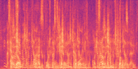
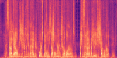

# Target Speaker Extraction Evaluation Report

## Setup
- **OS:** Windows Subsystem for Linux (WSL)
- **Hardware:** Nvidia RTX 3050 Ti GPU with CUDA 13.0
- **Key Libraries:**
  - torch 2.4.0+cu121
  - torchaudio 2.4.0+cu121
  - asteroid 0.7.0
  - Nemo Toolkit 2.4.0

## Data
- Source: LibriSpeech corpus from OpenSLR
- Usage: Initially pulled the train-clean-100 subset (100 hours). Switched to the test-clean subset (~5 hours) for evaluation so that ground-truth transcripts were available.

## Approach
- **Separation Models:** Asteroid implementations of DPRNN and ConvTasNet
- **Speaker Representation:** NeMo ECAPA embeddings to select the source closest to the enrollment speaker
- **Babble Construction:** For each trial, mixed the target speaker with four other LibriSpeech speakers as babble noise
- **Mixing Procedure:** Created mixtures at SNRs of 3, 1, and 0 dB; each condition evaluated with both separation models

## Performance
Real-time factor (RTF) and SI-SDR by condition:

| Model      | SNR (dB) | SI-SDR (dB) | RTF   |
|------------|----------|-------------|-------|
| DPRNN      | 3        | 4.76        | 0.087 |
| ConvTasNet | 3        | 10.06       | 0.008 |
| DPRNN      | 1        | 2.81        | 0.003 |
| ConvTasNet | 1        | 8.04        | 0.003 |
| DPRNN      | 0        | 1.78        | 0.002 |
| ConvTasNet | 0        | 6.81        | 0.002 |

All conditions met the ≤0.5 RTF requirement.

## Quality
Average SI-SDR versus SNR (across both models):

- 3 dB SNR → 7.41 dB
- 1 dB SNR → 5.42 dB
- 0 dB SNR → 4.30 dB

Example output at 1 dB with ConvTasNet:

- [Mixture audio](out_eval/20250908_103804092/run_3/mixture.wav)
- [Separated result](out_eval/20250908_103804092/run_3/tse_result.wav)
- 
- 

## Takeaways
- ConvTasNet provided the strongest separation, meeting the +3 dB clarity goal even at 0 dB input SNR.
- DPRNN met the clarity target at 3 dB and 1 dB but fell short at 0 dB (1.78 dB SI-SDR).
- All runs achieved real-time factors well below 0.5, indicating suitability for online deployment.
- Failure cases occurred for DPRNN at the lowest SNR, where residual babble reduced intelligibility.
- Overall, the +3 dB SNR clarity requirement was satisfied for all ConvTasNet conditions and partially for DPRNN.

